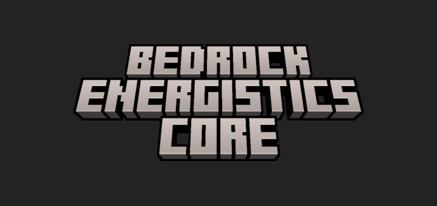

APIs for creating tech add-ons for Minecraft: Bedrock Edition.

Bedrock Energistics Core handles the parts every tech add-on would otherwise
have to build for itself — networks, storage, machine UI — so that machines from
separate add-ons can be placed side by side and work together.

## Features

- Machines using these APIs work with each other even if they're from different add-ons.
- Simple APIs for basic machines, while still having more powerful APIs for more complicated machines.
- Item storage APIs without persistent entities.
- Easily create machine UI.
- Create your own storage types (water, lava, etc) and share them between add-ons, not just energy.

## Configuration

Configure the add-on by editing `BP/scripts/__config.js` in the behavior pack with any text editor.

Every option is optional and is documented with a comment in the file. Remove an option to use its default. If an option is missing or set to the wrong type, its default is used and a warning is logged to the content log.

## Documentation

- [Getting Started](https://fluffyalien1422.github.io/bedrock-energistics-core/api/documents/Guides.Getting_Started.html)
- [Guides and API reference](https://fluffyalien1422.github.io/bedrock-energistics-core/api/)
- [Home page](https://fluffyalien1422.github.io/bedrock-energistics-core/)

## Contributing

See [CONTRIBUTING.md](CONTRIBUTING.md), and the [coding guidelines](CODING_GUIDELINES.md) before writing code. Bug reports and feature requests go [here](https://github.com/Fluffyalien1422/bedrock-energistics-core/issues/new/choose).

## License

This project is licensed under the [ISC License](LICENSE).
